<div align="center">

<!-- ANIMATED TYPING -->


<br/>

<!-- SOCIAL BADGES -->
[](https://www.linkedin.com/in/morenodwiputra)
[](https://kurobapak.site)
[](mailto:morenodwiputra147@gmail.com)

<br/>


</div>

---

## 🧑‍💻 About Me

```yaml
name: Moreno Dwiputra
alias: KuroBapak
role: IT Infrastructure & IoT Systems Engineer
education:
  university: President University — B.Sc. Computer Science (S.Kom.)
  gpa: "3.56 / 4.00"
  year: "2024 – Present"
  high_school: SMKN 1 Karawang — Rekayasa Perangkat Lunak (RPL)

focus:
  - Networking, Server Infrastructure & Virtualization
  - IoT & Embedded Systems (ESP32, MQTT, EMQX)
  - Full-Stack Web Development
  - Computer Vision & AI Integration

currently:
  - 🔭 Working on Homelab Server Infrastructure (Proxmox + OPNsense)
  - 🏢 First Vice Chairman @ President University Robotics & Technology Club
  - 🌱 Learning Cloud Architecture & Advanced Networking
  - 🤝 Open to collaborate on IoT, Infrastructure, and AI projects

fun_fact: "I build things that connect the physical world to the digital one 🔌"
```

---

## 🏆 Awards & Achievements

<div align="center">

🥈 **Silver Medal** — World Invention Competition & Exhibition (WICE) 2025 \
🥈 **2nd Place** — Majalengka IoT Competition 2023 \
🏅 **Top 15** — STEAM Innovation Festival \
🏆 **2nd Best Project** — Living World External Technology Expo

</div>

---

## 💼 Experience

| Role | Organization | Period |
|:-----|:-------------|:-------|
| **First Vice Chairman** | President University Robotics & Technology Club | Aug 2025 – Present |
| **PIC Academic** — FutureTech Robotics Workshop | President University Robotics & Technology Club | Mar 2025 – Oct 2025 |
| **IoT & System Developer** (Internship) | CV Smart Plus Indonesia — TEFA Smart Home | Feb 2024 – Apr 2024 |
| **IT & Server Staff** (Internship) | PERURI — Infrastructure Division | Aug 2022 – Oct 2022 |

---

## 🛠️ Tech Stack

<div align="center">

### 🖥️ Infrastructure & Networking


---

### 📡 IoT & Embedded Systems


> 🔗 **Self-Hosted EMQX Broker** — Running enterprise-grade MQTT broker on my homelab infrastructure for real-time IoT device communication, rule engine data routing to InfluxDB, and scalable pub/sub messaging across all projects.

---

### 💻 Backend & Web Development


---

### 🤖 AI & Computer Vision


---

### ⚙️ Tools & DevOps


</div>

---

## 📊 GitHub Stats

<!-- Cards are auto-generated daily by GitHub Actions — see .github/workflows/grs.yml -->

<p align="center">
  
  
</p>

<p align="center">
  
</p>

<!-- ACTIVITY GRAPH -->
<p align="center">
  
</p>

---

## 🏗️ Featured Projects

<div align="center">

### 🏭 Production & Inventory System with IoT Attendance
**Full-Stack & IoT Developer** · Jan 2026 – Feb 2026
> Enterprise system integrating PO, inventory, and production workflows with IoT fingerprint attendance (ESP32 + R503) and real-time dashboard analytics.

`Laravel` `ESP32` `R503 Fingerprint` `MySQL` `REST API`

---

### 🖥️ Homelab Server Infrastructure
**Infrastructure & Network Engineer** · Dec 2025 – Present
> Self-hosted infrastructure using Proxmox (2-node), Docker, OPNsense with VLAN segmentation, firewall rules, DMZ/LAN isolation, self-hosted EMQX broker, and 24/7 uptime.

`Proxmox` `OPNsense` `Docker` `VLAN` `Coolify` `EMQX`

---

### 🌱 [SmartGarden BRIN](https://github.com/KuroBapak/Project-SmartGarden-BRIN) — Autonomous Greenhouse Monitoring
**IoT & AI Systems Developer**
> Distributed intelligent system for agricultural greenhouse automation with real-time MQTT monitoring via self-hosted EMQX, YOLOv8 plant disease detection, AI-powered energy recommendations, and ESP32 microservice architecture.

`Laravel 12` `FastAPI` `YOLOv8` `EMQX` `MQTT` `InfluxDB` `ESP32`

---

### 🤟 American Sign Language AI System
**AI & Computer Vision Developer** · Sep 2025 – Oct 2025
> Real-time gesture recognition using TensorFlow & OpenCV with AI inference (FastAPI) integrated with Arduino hardware control.

`TensorFlow` `OpenCV` `FastAPI` `Arduino`

---

### 🏪 [Keshir](https://github.com/KuroBapak/Keshir) — Smart Café Management System
**Full-Stack Developer**
> Comprehensive POS system with role-based staff management, FIFO inventory, QR ordering, AI chatbot (Ollama), RFID attendance, real-time kitchen display, and Midtrans payment gateway.

`Laravel 12` `Blade` `MySQL` `Tailwind CSS` `Ollama AI` `RFID` `Midtrans`

---

### 🏠 SmartHome IoT Monitoring System
**IoT & Backend Developer** · Feb 2024 – Apr 2025
> Centralized platform for CCTV, sensors, locks, and environment monitoring with real-time device control using Laravel backend.

`Laravel` `ESP32` `MQTT` `Sensors` `Real-time`

---

### 🎮 Trust Your Friend? — Cooperative IoT Game
**IoT & System Developer** · Mar 2025 – May 2025
> 🏆 **2nd Best Project at External Technology Expo** — Cooperative IoT game using ESP32 + MQTT + web system.

`ESP32` `MQTT` `Web System` `IoT`

---

### 🍎 [ExpiryGuard](https://github.com/KuroBapak/Final-Projects) — Food Inventory Management
**Mobile Developer**
> Flutter app that reduces food waste with barcode scanning (OpenFoodFacts API), receipt OCR (Google ML Kit), smart expiration reminders, and offline-first architecture.

`Flutter` `Dart` `Firebase` `Google ML Kit` `Riverpod`

---

### 🎥 [Robot Sorting Conveyor](https://github.com/KuroBapak/Robot-Sorting-Conveyor) — IoT Automation
**Embedded Systems Developer**
> Intelligent robotics system with real-time sorting control, sensor-based object classification, and web-based monitoring interface.

`JavaScript` `Embedded Systems` `IoT` `Servo Control`

</div>

---

## 🎯 Current Focus

```text
🖥️  Infrastructure    ████████████████████░░░   Building & scaling homelab with Proxmox + OPNsense
📡  EMQX & MQTT       ██████████████████████░   Self-hosted MQTT broker for all IoT projects
🔌  IoT Systems       ██████████████████████░   ESP32 projects, sensor networks & device comms
🌐  Web Development   ██████████████████░░░░░   Laravel + React full-stack applications
🤖  AI/ML             ████████████████░░░░░░░   Computer vision & TensorFlow integrations
☁️  Cloud/DevOps      ██████████████░░░░░░░░░   Docker, self-hosting, CI/CD pipelines
```

---

## 🤝 Let's Connect

<div align="center">

I'm always excited to collaborate on **IoT systems**, **infrastructure engineering**, **AI integrations**, and **full-stack development**.

Whether it's building a smart system, setting up server infrastructure, or developing an intelligent web application — let's build something amazing together! 🚀

<br/>

[](https://www.linkedin.com/in/morenodwiputra)
[](mailto:morenodwiputra147@gmail.com)
[](https://kurobapak.site)

</div>

---

<!-- SNAKE CONTRIBUTION ANIMATION -->
<p align="center">
  
</p>


